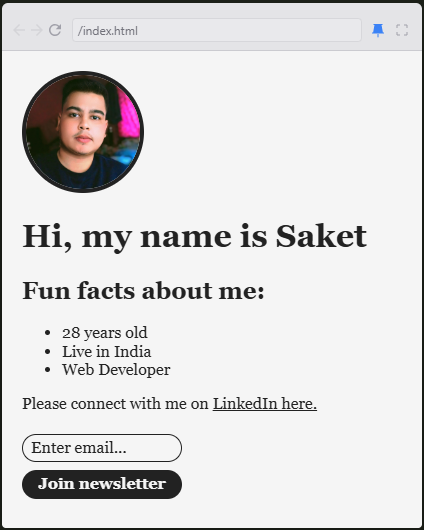

🌐 Simple Personal Website
Welcome to my Personal Website – a clean, modern, and minimalistic web presence built with simplicity and elegance in mind. This project is designed to showcase personal details, skills, projects, and contact information in a visually appealing way.

✨ Features
Sleek & Minimal Design – A clean and professional layout.
Responsive & Mobile-Friendly – Optimized for all screen sizes.
Smooth Animations – Subtle hover effects and transitions for a dynamic feel.
SCSS-Powered Styling – Clean and modular styling with SCSS.
Interactive Elements – Light JavaScript for smooth user experience.
🎯 Purpose
This personal website serves as a digital portfolio, resume, or even a simple online presence. It’s perfect for showcasing who you are, what you do, and how people can connect with you.

🛠️ Technologies Used
HTML – Structuring the website's content.
SCSS – Advanced CSS styling for better maintainability.
JavaScript – Adding interactive elements for enhanced UX.
🚀 How It Works
Home Page: A welcoming introduction with a brief bio and links to social media.
About Section: A deeper insight into personal skills, experience, and interests.
Projects Showcase: Display of past projects with descriptions and links.
Contact Form: Simple and elegant way for visitors to get in touch.
🖼️ Screenshots

A beautiful, responsive, and modern personal website.

📂 Getting Started
Clone the repository:
bash
Copy
Edit
git clone https://github.com/yourusername/personal-website.git
Navigate into the project folder:
bash
Copy
Edit
cd personal-website
Open index.html in your browser:
bash
Copy
Edit
open index.html
🔥 Future Enhancements
Blog Section – Add a simple blog to share thoughts and experiences.
Dark Mode Toggle – Allow users to switch between light and dark themes.
More Animations – Enhance user engagement with subtle effects.
👏 Contributions
Want to contribute or improve this project? Feel free to fork, open issues, or submit pull requests!

📧 Contact
Feel free to reach out with any questions or feedback!
Creator: Saket Prasad
Email: saketxprasad@gmail.com

Thank you for visiting! Hope you enjoy the project. 🚀✨